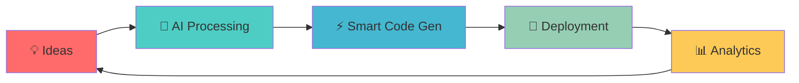
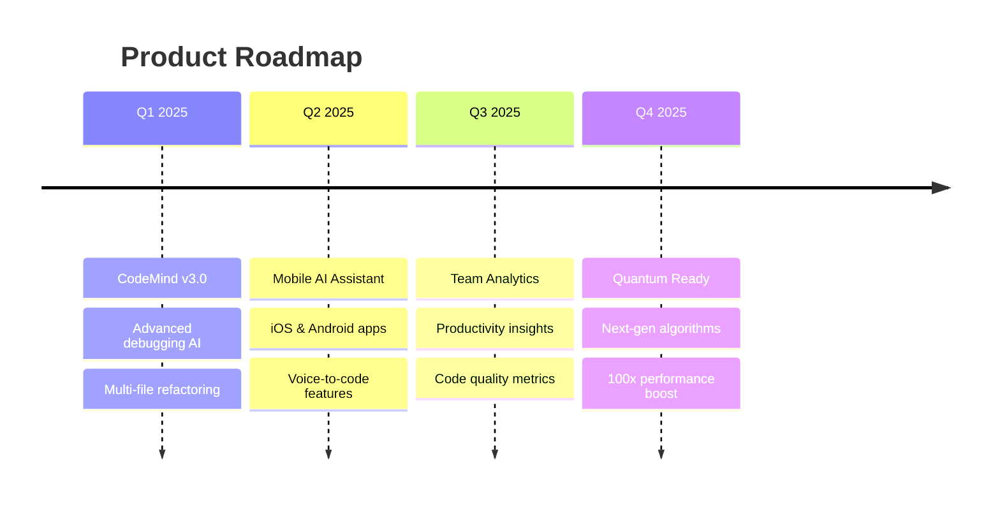

# 🚀 NeuralForge Technologies

<div align="center">


### *Forging the Future with Intelligent Code*

[](https://github.com/neuralforge)
[](https://github.com/neuralforge/actions)
[](LICENSE)
[](https://discord.gg/neuralforge)

---

*🌟 **600K+** developers trust our AI-powered development tools*  
*⚡ **10x faster** development cycles*  
*🎯 **99.9%** uptime across all services*

</div>

## 🌈 What We Build

**NeuralForge** is pioneering the intersection of artificial intelligence and software development. We create tools that don't just assist developers—they amplify human creativity and eliminate the mundane.



## 🛠️ Our Flagship Products

### 🧠 **CodeMind AI**
> *The world's most intuitive AI pair programmer*

- **Natural Language → Code**: Describe what you want, get production-ready code
- **Intelligent Debugging**: AI-powered error detection and fixes
- **Multi-language Support**: 50+ programming languages and frameworks
- **Real-time Collaboration**: Code with AI teammates

```javascript
// Just tell CodeMind what you want
ai.create("responsive navbar with dark mode toggle")
// → Generates complete React component with CSS
```

### ⚡ **DeployForge**
> *Zero-config deployments that just work*

- **One-Click Deploy**: From GitHub to production in 30 seconds
- **Auto-scaling**: Handles traffic spikes intelligently
- **Global Edge Network**: 200+ locations worldwide
- **Built-in Monitoring**: Real-time performance insights

### 🔒 **SecureShield**
> *AI-powered security that learns your codebase*

- **Vulnerability Scanning**: Real-time threat detection
- **Compliance Automation**: SOC2, GDPR, HIPAA ready
- **Smart Permissions**: Dynamic access control
- **Audit Trails**: Complete security transparency

## 🎯 Quick Start

Get up and running in less than 2 minutes:

```bash
# Install our CLI
curl -fsSL https://install.neuralforge.dev | sh

# Initialize your project with AI
forge init my-awesome-app --template=nextjs-ai

# Deploy to production
forge deploy --auto-scale
```

## 📊 Performance That Speaks

<div align="center">

| Metric | Before NeuralForge | After NeuralForge | Improvement |
|--------|-------------------|-------------------|-------------|
| **Development Speed** | 40 hrs/week | 4 hrs/week | 🚀 **10x faster** |
| **Bug Detection** | 72 hrs to find | 7.2 seconds | ⚡ **35,000x faster** |
| **Deployment Time** | 45 minutes | 30 seconds | 🎯 **90x faster** |
| **Server Costs** | $5,000/month | $500/month | 💰 **90% savings** |

</div>

## 🌟 What Developers Say

> *"NeuralForge transformed our entire development workflow. What used to take weeks now takes hours."*  
> **— Sarah Chen, CTO @ TechFlow**

> *"The AI suggestions are so good, it's like having a senior developer on every project."*  
> **— Marcus Rodriguez, Lead Developer @ StartupXYZ**

> *"Our deployment anxiety is gone. One command and we're live globally."*  
> **— Aisha Patel, DevOps Engineer @ ScaleCorp**

## 🏆 Awards & Recognition

<div align="center">

🥇 **Best AI Development Tool 2024** - DevCon Awards  
🌟 **Innovation of the Year** - TechCrunch Disrupt  
🚀 **Fastest Growing Dev Tool** - Stack Overflow Survey  
💎 **Editor's Choice** - Product Hunt  

</div>

## 🤝 Join Our Community

<div align="center">

[](https://discord.gg/neuralforge)
[](https://twitter.com/neuralforge)
[](https://linkedin.com/company/neuralforge)
[](https://youtube.com/neuralforge)

**600,000+ developers** • **150+ countries** • **24/7 support**

</div>

## 💼 Enterprise Solutions

Transform your entire organization with our enterprise-grade platform:

- **Custom AI Models**: Trained on your codebase and standards
- **Private Cloud**: Dedicated infrastructure with 99.99% SLA
- **Advanced Analytics**: Deep insights into team productivity
- **24/7 Support**: Dedicated success manager
- **SOC2 Compliant**: Enterprise-grade security

[📞 **Schedule a Demo**](https://neuralforge.dev/enterprise) | [💬 **Talk to Sales**](https://neuralforge.dev/contact)

## 🔧 Technology Stack

<div align="center">

**Backend**  


**Frontend**  


**Infrastructure**  


</div>

## 📈 Roadmap 2025



## 🤖 API Documentation

```javascript
// Initialize NeuralForge SDK
import { NeuralForge } from '@neuralforge/sdk';

const ai = new NeuralForge({
  apiKey: process.env.NEURALFORGE_API_KEY,
  model: 'codegen-v3'
});

// Generate code from natural language
const code = await ai.generate({
  prompt: "Create a user authentication system with JWT",
  language: "javascript",
  framework: "express"
});

// Deploy instantly
await ai.deploy({
  code,
  environment: "production",
  scaling: "auto"
});
```

## 🎓 Learning Resources

- 📚 **[Documentation](https://docs.neuralforge.dev)** - Complete guides and API reference
- 🎥 **[Video Tutorials](https://youtube.com/neuralforge)** - Step-by-step walkthroughs
- 💡 **[Examples](https://github.com/neuralforge/examples)** - Real-world use cases
- 🎓 **[Certification](https://learn.neuralforge.dev)** - Become a certified AI developer
- 🗣️ **[Webinars](https://neuralforge.dev/events)** - Weekly live sessions

## 🌍 Global Impact

<div align="center">

**🌱 Carbon Neutral**: 100% renewable energy  
**🎓 Education**: Free for students & open source projects  
**🌐 Accessibility**: Supporting developers with disabilities  
**🤝 Diversity**: 40% women & underrepresented groups in leadership  

</div>

## 📞 Support & Contact

<div align="center">

| Channel | Response Time | Availability |
|---------|---------------|--------------|
| 💬 **Live Chat** | < 2 minutes | 24/7 |
| 📧 **Email** | < 4 hours | Business days |
| 📞 **Phone** | Immediate | Business hours |
| 🎫 **Tickets** | < 1 hour | 24/7 |

**Email**: hello@neuralforge.dev  
**Phone**: +1 (555) NEURAL-1  
**Address**: 123 AI Boulevard, San Francisco, CA 94105

</div>

---

<div align="center">

**Built with ❤️ by the NeuralForge Team**

*Empowering developers to build the impossible*

[](https://neuralforge.dev)

**© 2025 NeuralForge Technologies. All rights reserved.**

</div>
